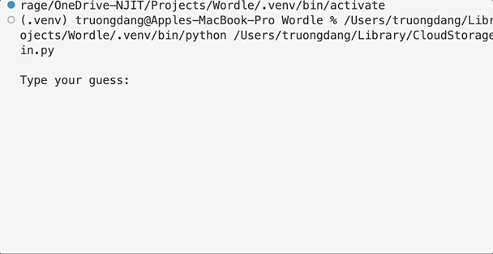
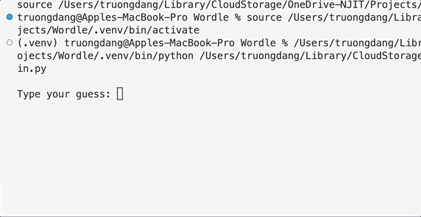

# Wordle in Python by GDSC @ NJIT
> Build Wordle game running on terminal using Python.

## Attempt 1: CORRECT 

- Input is shorter/longer than expected.
- Input does not have any meaning (that's a cheat).

## Attempt 2: CORRECT

- Easy solution.

## Attempt 3: WRONG

